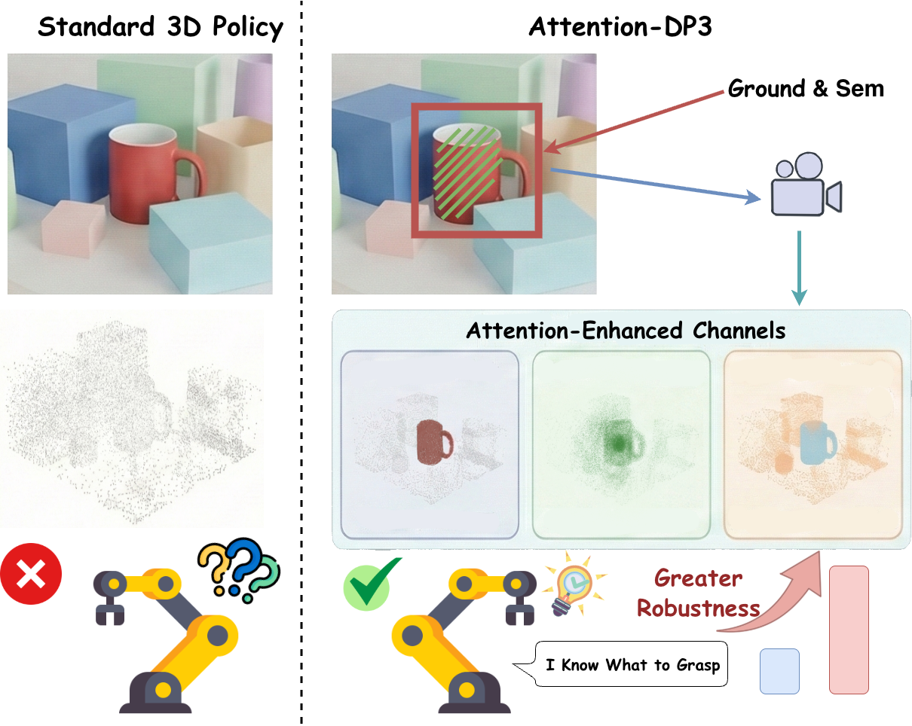

<div align="center">

# Attention-DP3

### Spatially Object-aware 3D Diffusion Policy via Geometry-aligned Attentional Conditioning

[](https://www.python.org/)
[](https://pytorch.org/)
[](3D-Diffusion-Policy/LICENSE)

**Changbo Yan\***, **Zhongbo Zhang\***, **Zaibin Zhang\***, Lijun Wang, **Yifan Wang†**, Huchuan Lu  
Dalian University of Technology · \* Equal contribution · † Corresponding author

</div>



Attention-DP3 makes a 3D diffusion policy aware of the object named by a language goal. It uses Grounding DINO and SAM2 to obtain an open-vocabulary 2D mask, lifts that mask onto the calibrated point cloud, and constructs three geometry-aligned attention fields while preserving the original DP3 diffusion backbone.

## Installation

The benchmark stack targets Linux, Python 3.10, an NVIDIA GPU, and a CUDA toolkit compatible with PyTorch. MuJoCo-based Adroit and MetaWorld environments use legacy packages bundled in `third_party/`; install them in a dedicated environment.

```bash
conda create -n attn-dp3 python=3.10 -y
conda activate attn-dp3

# Choose the PyTorch command matching your CUDA version from pytorch.org.
pip install torch torchvision --index-url https://download.pytorch.org/whl/cu121
pip install -r requirements.txt

# Core policy and local benchmark packages.
pip install -e 3D-Diffusion-Policy
pip install -e visualizer
pip install -e third_party/pytorch3d_simplified
pip install -e third_party/Metaworld
pip install -e third_party/dexart-release
pip install -e third_party/rrl-dependencies/mj_envs
pip install -e third_party/rrl-dependencies/mjrl
pip install -e third_party/rrl-dependencies
```

Adroit and MetaWorld additionally require MuJoCo 2.1 and the bundled legacy Gym stack. Set `MUJOCO_PY_MUJOCO_PATH` to your MuJoCo 2.1 installation, then install:

```bash
pip install -e third_party/mujoco-py-2.1.2.14
pip install -e third_party/gym-0.21.0
```

Install the open-vocabulary segmentation stack after PyTorch and CUDA are available:

```bash
SAM2_BUILD_CUDA=1 pip install -e Grounded-SAM-2
pip install --no-build-isolation -e Grounded-SAM-2/grounding_dino
```

Download the SAM2.1 and Grounding DINO checkpoints with the included scripts:

```bash
cd Grounded-SAM-2
bash checkpoints/download_ckpts.sh
bash gdino_checkpoints/download_ckpts.sh
cd ..
```

`Grounded-SAM-2/INSTALL.md` contains CUDA compilation troubleshooting. DexArt also depends on `sapien==2.2.1`; availability depends on the Python version and platform.

## Data Preparation

The repository provides pipelines for Adroit, DexArt, and MetaWorld. Generated Zarr datasets are written under `3D-Diffusion-Policy/data/`. Adroit and DexArt scripts include the full mask-to-`attn_3d` conversion; the MetaWorld script can be extended with the same `gs2.sh` and converter steps for a selected task.

```bash
# Adroit: door, hammer, and pen. Generates environment-mask and GS2 variants.
MAX_EP=50 GPU=0 DEVICE=cuda:0 bash scripts/make_adroit_datasets.sh

# DexArt: bucket, faucet, laptop, and toilet.
MAX_EP=100 DEVICE=cuda:0 bash scripts/make_dexart_datasets.sh

# MetaWorld: generate expert demonstrations (override TASKS as needed).
TASKS="basketball hammer pick-place" MAX_EP=50 DEVICE=cuda:0 \
  bash scripts/make_metaworld_datasets.sh
```

For a custom Zarr dataset with RGB and UV-augmented point clouds, the attention conversion can be run directly:

```bash
python scripts/convert_zarr_with_attn3d.py \
  --input_zarr 3D-Diffusion-Policy/data/input.zarr \
  --json_root 3D-Diffusion-Policy/export_gs2/task \
  --output_zarr 3D-Diffusion-Policy/data/task_attn3d.zarr \
  --n_points 512
```

## Training and Evaluation

Task configurations live in `3D-Diffusion-Policy/diffusion_policy_3d/config/task/`. Names without `_no_attn` enable the three attention fields; matching `_no_attn` configurations provide DP3 baselines.

```bash
# Arguments: algorithm task run_tag seed gpu_id
bash scripts/train_policy.sh dp3 adroit_hammer experiment 0 0
bash scripts/train_policy.sh dp3 adroit_hammer_no_attn baseline 0 0

# Evaluate a completed run using the same arguments.
bash scripts/eval_policy.sh dp3 adroit_hammer experiment 0 0
```

Other examples include `dexart_laptop`, `metaworld_pick-place`, and `metaworld_pick-place-wall`. Weights & Biases logging is enabled by default; set `logging.mode=offline` in the Hydra overrides or edit the launcher when running without an account.

## Repository Layout

```text
Attn-dp3/
├── 3D-Diffusion-Policy/   # policy, encoders, task configs, training and evaluation
├── Grounded-SAM-2/        # language grounding and segmentation
├── scripts/               # dataset, attention, training and evaluation pipelines
├── third_party/           # benchmark environments and point-cloud dependencies
├── docs/                  # experiment and implementation notes
├── assets/                # README figures from the paper
└── requirements.txt       # shared Python dependencies
```

## Citation

```bibtex
@inproceedings{yan2026attentiondp3,
  title     = {Attention-DP3: Spatially Object-aware 3D Diffusion Policy via Geometry-aligned Attentional Conditioning},
  author    = {Yan, Changbo and Zhang, Zhongbo and Zhang, Zaibin and Wang, Lijun and Wang, Yifan and Lu, Huchuan},
  booktitle = {European Conference on Computer Vision},
  year      = {2026}
}
```

## Acknowledgements

This codebase builds on [3D Diffusion Policy](https://github.com/YanjieZe/3D-Diffusion-Policy), [Grounded SAM 2](https://github.com/IDEA-Research/Grounded-SAM-2), [MetaWorld](https://github.com/Farama-Foundation/Metaworld), and [DexArt](https://github.com/Kami-code/dexart-release).
